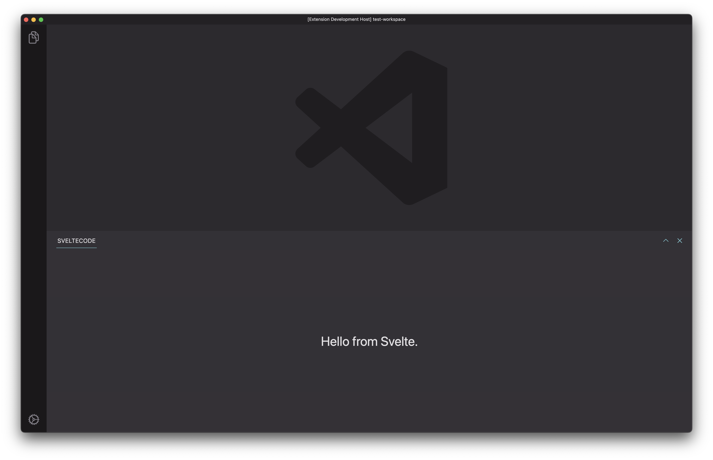

# svelte-vscode-boilerplate

This is a boilerplate for building a Visual Studio Code extension. This extension has a Webview that hosts a Svelte application. It's based on the Wingman extension: https://github.com/nvms/wingman

<center>



</center>

# Development

1. In `/webview`: `npm run dev`. This is a Svelte project that outputs to `/extension/dist`.
2. In `/extension`: `npm run build:watch`
3. Run the extension using the debug panel.

The `dev` script in `/webview` runs both `vite` and `vite build --watch`. This is so that you can use either http://localhost:5173 (with HMR) or the VSCode extension host (no HMR) to build your UI.

# Tips for packaging locally

The included `/extension/install.sh` will:

- Build the extension
- Build the webview
- Create the VSIX package
- Uninstall the existing extension
- Install the new VSIX package

Afterwards, run the `Developer: Restart extension host` command. I mapped this to `cmd+r` in `keybindings.json` like this:

```json
  {
    "key": "cmd+r",
    "command": "workbench.action.restartExtensionHost",
  },
```

# Releasing

Run the `release` script in `/extension` to bump package.json, create a git tag and push changes to the remote origin. There's a Github workflow that, on tag, builds the extension and publishes to the Visual Studio Marketplace. You'll need to set the repo secret `VS_MARKETPLACE_TOKEN` to your PAT.
